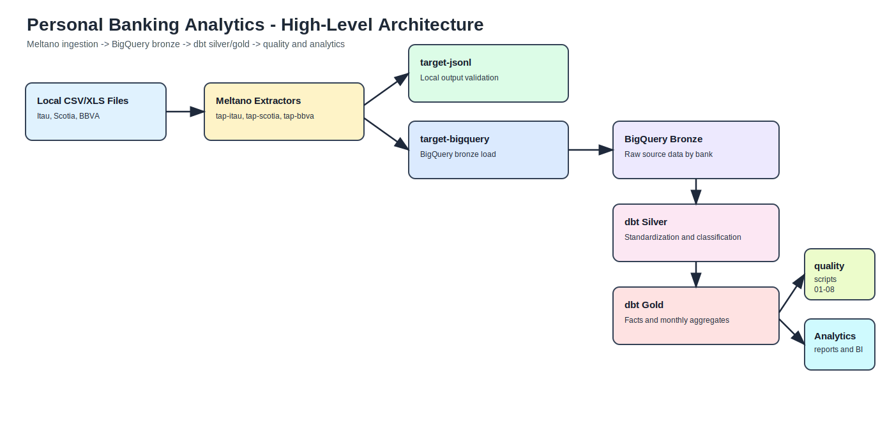

# Personal Finance - Banking Ingestion Pipeline

ETL/ELT project built with Meltano to consolidate personal banking movements from local files (CSV/XLS) into BigQuery.

## Goal

Unify personal bank-account movements in a reproducible workflow to:

- validate ingestion locally in JSONL,
- load source data into the data warehouse,
- enable downstream financial analytics.

## Data Architecture

- Medallion architecture.
- Ingestion first lands in the `bronze` layer.
- Current BigQuery dataset for ingestion: `bronze`.

### High-Level Architecture Diagram



Source diagram file: `docs/architecture/high-level-architecture.svg` (SVG, GitHub-renderable and scalable).
Editable source: `docs/architecture/high-level-architecture.drawio` (open in diagrams.net / draw.io).

## Configuration Source of Truth

All pipeline configuration lives in `meltano.yml`.

## dbt Transformations (silver/gold)

The analytical transformation layer with dbt is documented in:

- `transform/README.md`

It includes:

- prerequisites and profile setup,
- model execution (`dbt run` / `dbt build`),
- test execution (`dbt test`),
- local documentation and lineage generation (`dbt docs generate` / `dbt docs serve`).

## Data-Model Business Assumptions

These assumptions drive `silver` and `gold` model design for consistent analytics:

1. **Closed movement classification**
   - Every movement is classified as `income`, `expense`, or `internal_transfer`.
   - Open-ended categories are avoided in the canonical layer to prevent aggregate ambiguity.

2. **Internal transfers are not real income/expense**
   - `internal_transfer` represents movement of own funds.
   - In `gold`, it does not impact `income_amount` or `expense_amount`.
   - It may appear in movement counts, but it must not distort real cash flow.

3. **Absolute amount normalization in `silver`**
   - `debit_amount` and `credit_amount` are normalized to absolute values for consistent rules.
   - Accounting semantics come from `movement_type`, not numeric sign.

4. **Do not persist net balance in detail tables**
   - `net_balance` is not stored as a physical column in detail-level `silver`/`gold` tables.
   - Net balance is computed in queries/aggregates to avoid duplicated logic.
   - Definition: `net_balance = income - expense`.

5. **Medallion responsibility by layer**
   - `bronze`: raw source data.
   - `silver`: standardization, cleansing, classification.
   - `gold`: facts and consumption-ready aggregates.

6. **Reconciliation by movement type**
   - Validation of `debit -> expense` and `credit -> income` is done by `movement_type`.
   - Comparing total debits against expenses without isolating `internal_transfer` creates false-positive data-shift alerts.

7. **Monthly data shift can be legitimate due to financial cycles**
   - Large monthly imbalances may be explained by multi-month cycles (for example, investments).
   - A monthly imbalance does not automatically imply ETL failure; validate with audit scripts.

## Configured Sources

- Itau (`tap-itau`)
  - Source: `data/itau/debito/debito_xlsx/*.xlsx`
  - Type: excel
  - Sheet: `Estado de Cuenta`
  - `skip_rows: 6`
  - Note: `.xls` files are converted to `.xlsx` with `extract/convert_itau_xls_to_xlsx.py`.

- Scotia (`tap-scotia`)
  - Source: `data/scotia/debito/*.csv`
  - Type: csv
  - Table: `scotia_debito`
  - `skip_rows: 0`

- BBVA (`tap-bbva`)
  - Source: `data/bbva/debito/*.csv`
  - Type: csv
  - Table: `bbva_debito`
  - `skip_rows: 5`

## Configured Targets

- Local (`target-jsonl`)
  - Output: `output/`
  - Timestamped files (`do_timestamp_file: true`)

- BigQuery (`target-bigquery`, variant `z3z1ma`)
  - Project: `finanzas-personales-457115`
  - Dataset: `bronze`
  - Method: `batch_job`
  - Credentials: `secrets/finanzas-personales.json`
  - Reload strategy by stream: `overwrite` for `scotia_debito`, `itau_debito`, and `bbva_debito`

## Transformation Rules (stream_maps)

- `itau_debito`: filters balance rows (`SALDO ANTERIOR` and `SALDO FINAL`).
- `bbva_debito`: filters empty CSV rows (`fecha is not None`).

## Initial Setup Requirements

### Python version

- Recommended: `Python 3.11` inside the `meltano` conda environment.
- Practical compatibility for this repo (based on pinned dependencies in `requirements.txt`): `Python 3.10+`.
- Rule: keep one Python version per environment and run all Meltano/dbt commands from that same environment.

Quick check:

```bash
conda run -n meltano python --version
```

### Input data path contract (where to place files)

Put raw statement files under `data/<bank>/debito/`.

Supported paths in the current configuration:

- Itau (Excel)
  - `data/itau/debito/debito_xls/*.xls` (raw source files)
  - `data/itau/debito/debito_xlsx/*.xlsx` (converted files used by tap-itau)
- Scotia (CSV)
  - `data/scotia/debito/*.csv`
- BBVA (CSV)
  - `data/bbva/debito/*.csv`

Example layout:

```text
data/
   itau/
      debito/
         debito_xls/
            statement_2026_03.xls
         debito_xlsx/
            statement_2026_03.xlsx
   scotia/
      debito/
         Caja_de_Ahorros_UYU_003-3189628201_032026.csv
   bbva/
      debito/
         Movimientos_032026.csv
```

Notes:

- For Itau, run the converter step before loading to BigQuery: `conda run -n meltano meltano run pre-itau:convert_xls tap-itau target-bigquery`.
- Do not place source files in `output/`; that folder is generated by `target-jsonl`.

## Execution Requirements

Always use the `meltano` conda environment before running Meltano.

- Interactive: `conda activate meltano`
- Non-interactive: `conda run -n meltano <command>`

## Initial Setup

```bash
conda activate meltano
python -m pip install --upgrade pip
pip install -r requirements.txt
meltano install --clean
```

## Recommended Flow (JSONL First)

1. Test local extraction with JSONL:

   ```bash
   conda run -n meltano meltano run tap-itau target-jsonl
   conda run -n meltano meltano run tap-scotia target-jsonl
   conda run -n meltano meltano run tap-bbva target-jsonl
   ```

2. Quickly validate files in `output/`.

3. Load to BigQuery:

   ```bash
   conda run -n meltano meltano run pre-itau:convert_xls tap-itau target-bigquery
   conda run -n meltano meltano run tap-scotia target-bigquery
   conda run -n meltano meltano run tap-bbva target-bigquery
   ```

## Validation and Analysis Scripts

After loading data to BigQuery, run validation scripts in `quality/analysis/`.

Quick validation (immediately after load):

```bash
conda run -n meltano python3 quality/analysis/01_validate_shift.py [bank] [YYYY-MM]
```

Expected output:

```text
✅ NO DATA SHIFT - Normal, data is consistent from source to aggregate
⚠️  DATA SHIFT DETECTED - Run scripts 02-06 for investigation
```

Full investigation:

1. `01_validate_shift.py` - Bronze→Silver→Gold reconciliation
2. `02_audit_flow.py` - Audit where rows are filtered
3. `03_analyze_investment_cycles.py` - Detect debit→credit cycles
4. `04_monthly_investment_impact.py` - Monthly cycle impact
5. `05_deep_investment_analysis.py` - Deep analysis without time-window restriction
6. `06_monthly_impact_analysis.py` - Final decision on legitimate data shift

See [quality/analysis/README.md](quality/analysis/README.md) for:

- recommended execution order,
- script-by-script interpretation,
- use cases (quick validation, investigation, full audit),
- troubleshooting.

Guardrail: all scripts require `secrets/finanzas-personales.json` to be available.

## Validation Checklist

1. Run inside the `meltano` environment.
2. `meltano run ...` finishes without errors.
3. Local tests generate JSONL files in `output/`.
4. Expected fields are present (`fecha`, `concepto`, `debito`/`credito`, `saldo` depending on bank).
5. Rows are loaded in BigQuery after ingestion.

## Guardrails

- Do not run Meltano outside the `meltano` conda environment.
- Do not modify `data/` or `output/` unless explicitly requested.
- Do not expose secrets or print contents of `secrets/finanzas-personales.json`.
- Prioritize changes in `meltano.yml` and documentation before adding new scripts.
